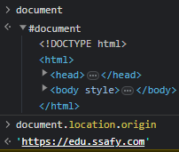

<div align=center>
  <h1> SOP 😺 </h1>
</div>

> 발표일　　|　 2023.08.23 <br />
> 발표자　　|　강준영 <br />

<div align=center>
  <h3>📇 목차 </h3>
</div>

[1. 정의](#🏭-정의)<br />
[2. 구별](#🌊-구별)<br />
[3. 예시](#🦴-예시) <br />
[4. CORS](#🧩-CORS) <br />

<br>

# 🏭 정의

```
- SOP : Same Origin Policy

- 한 origin으로부터 로드된 document 또는 script가 다른 origin의 리소스와 상호작용 할 수 있는 방법을 제한하는 중요한 보안 메커니즘.

- 특정 페이지에 들어가면 html document를 넘겨줌. 브라우저는 document를 해석해서 보여주는데, 이 document가 온 곳을 "origin" 이라고 함.
```



```
- 이때 외부 리소스와 상호작용을 할 때, 리소스의 origin이 document의 origin 과 다를 경우 제한을 두겠다는 것이 Same Origin Policy.
```

<br>

# 🌊 구별

## Scheme, Host, Port

```
- Origin을 구분하는 요소.

ex) https://edu.ssafy.com:443/path/page.html

- Scheme(Protocol) : https

- Host : edu.ssafy.com

- Port : 443
```

```
ex)
https://edu.ssafy.com:path/page.html
https://edu.ssafy.com:443/path/page.html

Q. 둘은 같은 origin?

A. Yes. https의 기본 포트는 443


ex)
http://edu.ssafy.com:path/page.html
https://edu.ssafy.com:443/path/page.html

Q. 둘은 같은 origin?

A. No. Scheme이 다름
```

# 🦴 예시

## 시나리오

#### SOP가 없을 경우

```
1. 공격자는 서버를 만들어두고 (ex: https://edu.ssafy.com) 사용자에게 클릭을 유도함
2. 해당 페이지 접속 시 https://mail.google.com/mail.inbox 페이지에 GET 요청을 보냄
3. 개인 컴퓨터에는 쿠키로 정보가 저장되어 있기에 바로 로그인이 되고 mail 목록을 GET으로 얻음
4. script에 XMLHttpRequest() 등의 HTTP 요청을 보내는 부분을 넣어 GET으로 얻은 mail 내용을 공격자의 서버로 전송함.
```

=> 클릭 한 번으로 메일 내용을 공격자가 볼 수 있음

#### SOP가 있을 경우

```
1. 공격자는 서버를 만들어두고 (ex: https://edu.ssafy.com) 사용자에게 클릭을 유도함
2. 해당 페이지 접속 시 https://mail.google.com/mail.inbox 페이지에 GET 요청을 보냄
3. 개인 컴퓨터에는 쿠키로 정보가 저장되어 있기에 바로 로그인이 되고 mail 목록을 GET으로 얻으려 했으나

Host가 달라 (edu.ssafy.com, mail.google.com) 읽을 수 없음

CORS 에러 발생

```

#### ※ CSRF 공격

```
Cross Site Reuqest Forgery

일반적으로(preflight request 제외) Origin이 다르더라도 write는 가능.

위 예시에서는 GET으로 정보를 불러오는 과정에서 Same-Origin이 아닌 Cross-Origin으로 접근이 막혔지만
만약 비밀번호를 수정하는 API가 POST로 작동한다면? 사용자 자신의 의지와는 관계없이 비밀번호를 바꾸게됨

따라서 서버는 이에 맞는 방어 기법들을 적용해야함.
```

- prefilght request : 실제 요청 전 브라우저에서 서버로 보내는 작은 요청. 백엔드 서버에서 허용한 Origin이 맞는지, 해당 엔드포인트에서 어떤 HTTP 메소드를 허용하는지 확인.

<br>

# 🧩 CORS

#### Cross Origin Resource Sharing

```
교차 출처 리소스 공유

- 인터넷 환경에서 결국 다른 Origin의 리소스를 받아오는 경우가 많음. 이 CORS 정책을 지켜서 안전하게 사용해야함.

- 보통 Same Origin이 아닐 경우 CORS 에러가 발생함.

- http status code가 200이더라도 발생할 수 있음.

- 프론트에서 겪는 오류지만 해결은 백엔드에서 진행
```

#### 해결방법

```
1. Access-Control-Allow-Origin 세팅

- 응답 헤더의 "Access-Control-Allow-Origin" 이라는 값에 리소스를 접근하는 허용된 출처를 내려줌.

- 브라우저는 헤더의 "Access-Control-Allow-Origin" 와 요청의 Origin을 비교해서 유효한지 확인

- 와일드카드인 * 를 내려주면 모든 출처에서 오는 요청 받을 수 있음 -> 매우 취약

- 이름있는 백엔드 프레임워크의 경우 CORS 관련 설정을 위한 세팅이나 미들웨어 라이브러리를 제공.


2. Webpack Dev Server로 리버스 프록싱

- 대부분 프론트엔드 개발자들이 CORS 에러를 겪는 이유는 로컬의 http://localhost:3000 에서 개발하기 때문.

- 서버에서 Access-Control-Allow-Origin 헤더에 http://localhost:3000 을 추가한다? 드묾.

- 프론트는 대부분 웹팩과 webpack-dev-server를 이용해서 환경 구축.

- 라이브러리가 제공하는 프록시 기능을 사용하면 CORS 우회 가능

ex) /api 로 시작하는 URL로 보내는 요청
-> 브라우저는 localhost:3000/api 로 보냈다고 생각
-> 프록시 설정하면 웹팩이 https://api.edu.ssafy.com으로 요청 프록싱해줌

```

#### 출처

1. SOP(Same Origin Policy)를 모르고 Web을 논하지 마라 / SOP가 없다면 어떻게 될까? / CORS: https://www.youtube.com/watch?v=6QV_JpabO7g
2. CORS는 왜 이렇게 우리를 힘들게 하는걸까?: https://evan-moon.github.io/2020/05/21/about-cors/
